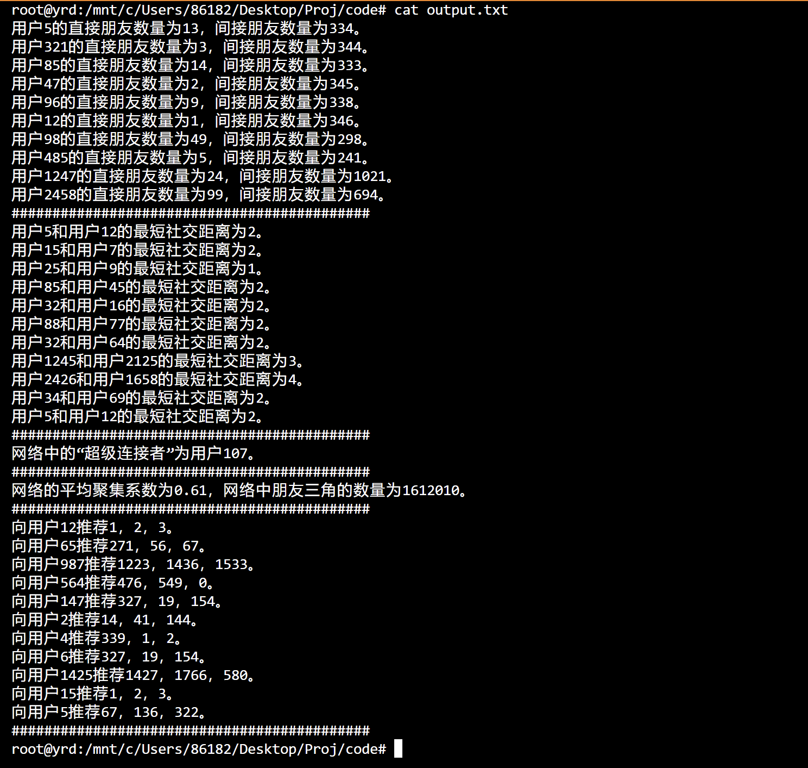

# What this is
    My solution to Proj of COMP130004.

# Disclaimer
    It is a really, really bad idea to post it on github publicly.
    Although some of you may don't think so.

    If you seek to copy code snippets from this project, 
    please display prominently that "it is NOT my own work" 
    in case all of us get into plagiarism inspection.

    Also, it is guaranteed that my solution will be correct but NOT
    optimal. You are free to modify the methods I wrote.

# Debug Tool
I wrote a friend checker which can tell whether two users are **direct** friends or not
(since trying to do so by looking at the data.txt is non-trivial).

Hopefully it can help you with debugging.

Here's a demonstration of how to use it.
```
PS C:\Users\86182\Desktop\Proj\code> c++ checker.cpp -o checker -Wall
PS C:\Users\86182\Desktop\Proj\code> .\checker
432 500
not friends
432 557
friends
1578 1496
not friends
^Z
```

# Parallel Optimization
First change the `#include "Matrix.hpp"` in `Relationship.hpp` into `#include "Parallel.h"` and then compile and run like this:
```
root@yrd:/mnt/c/Users/86182/Desktop/COMP130004/code# c++ -std=c++11 -Wall -fopenmp main.cpp Parallel.cpp
root@yrd:/mnt/c/Users/86182/Desktop/COMP130004/code# ./a.out
直接朋友数量,间接朋友数量计算完成,用时0s.
最短社交距离计算完成,用时0s.
所有超级用户查找完成,用时0s.
高级要求a运算完成,用时50s.
高级要求b运算完成,用时1s.
```
Optimization of matrix operation using is nearly 4 times faster(without compromising correctness)!   
Can we do better? **Pull requests welcomed!**

# Bug Report
Here is a screen shot of my output using original "sample.txt".


I would appreciate it if you a) notice something wrong with it and b) can send me a bug report.
